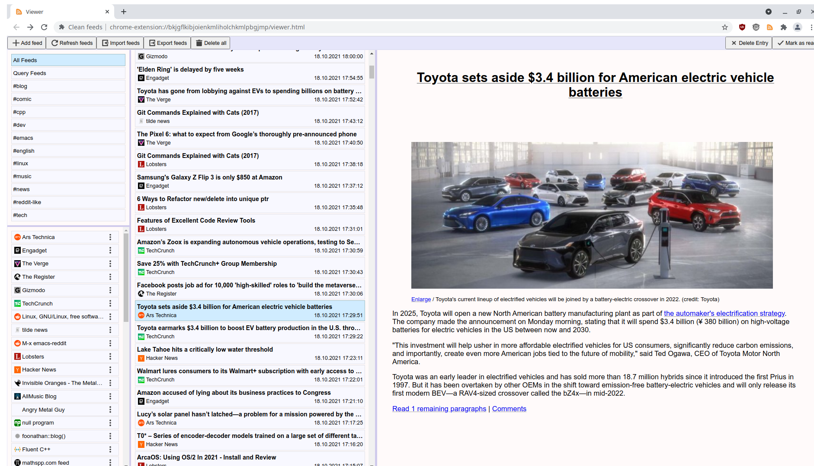

# clean-feeds
## Shortcuts
- a: add new feed
- m: mark as read
- r: refresh feeds
- b, o, v: open/view page
- d: delete entry
- up, n: next entry
- down, p: previous entry
- e: export
- i: import
## screenshot

